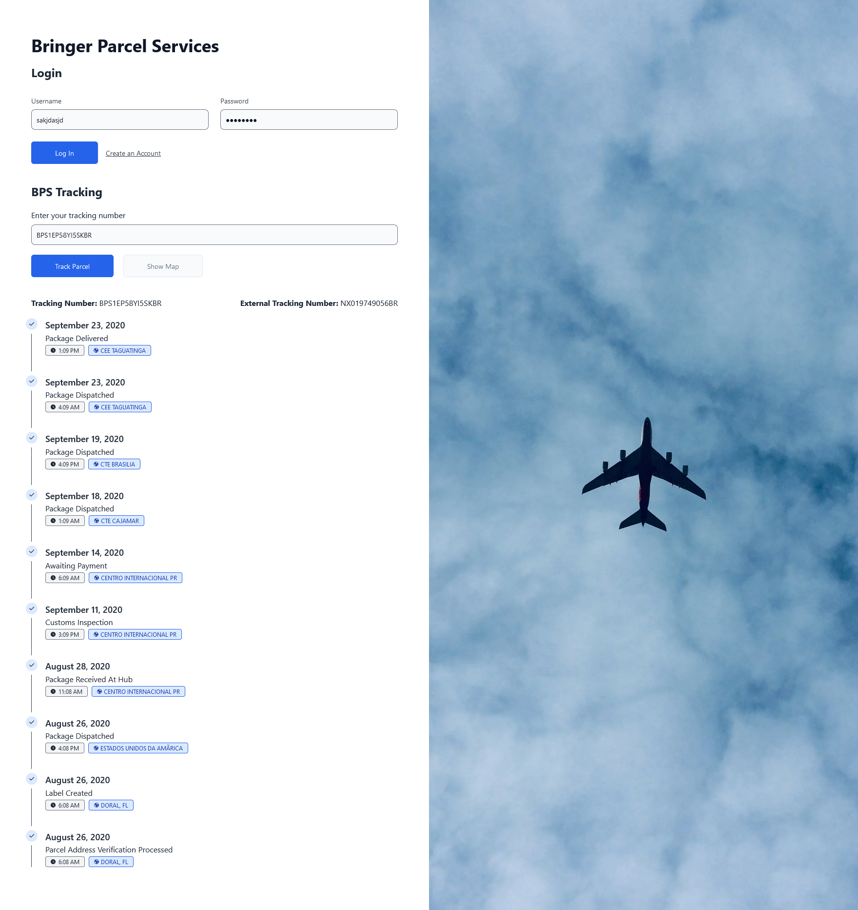

# Untitled

This is a project utilizing a Node.js environment with separate frontend and backend directories. The project uses Concurrently to run both the backend and frontend services simultaneously during development.

  

## Getting Started

These instructions will get you a copy of the project up and running on your local machine for development and testing purposes.

### Prerequisites

Before you begin, ensure you have the following installed:

- [Node.js](https://nodejs.org/en/download/)
- npm (usually comes with Node.js)

### Installation

1. Clone the repository to your local machine:

   ```bash
   git clone https://github.com/lsprr/untitled.git
   ```

2. Navigate into the project directory:

   ```bash
   cd untitled
   ```

3. Install the necessary dependencies:

   ```bash
   npm run install
   ```

4. Navigate to the backend directory, rename/edit/save the env:

   ```bash
   cd backend
   rename .env-example to .env
   add generated tokens to JWT_SECRET & BEARER_TOKEN
   save .env
   ```

5. Return to the project root directory:

   ```bash
   cd ..
   ```

### Running the Application

To run both the backend and frontend services concurrently:

```bash
npm run dev
```

Alternatively, you can run them separately:

- For the backend:

  ```bash
  npm run backend
  ```

- For the frontend:

  ```bash
  npm run frontend
  ```

## Built With

- [Node.js](https://nodejs.org/) - The JavaScript runtime used.
- [Concurrently](https://www.npmjs.com/package/concurrently) - Used to run multiple npm commands concurrently.

## Authors

- Luis Parra - Initial work - [lsprr](https://github.com/lsprr)